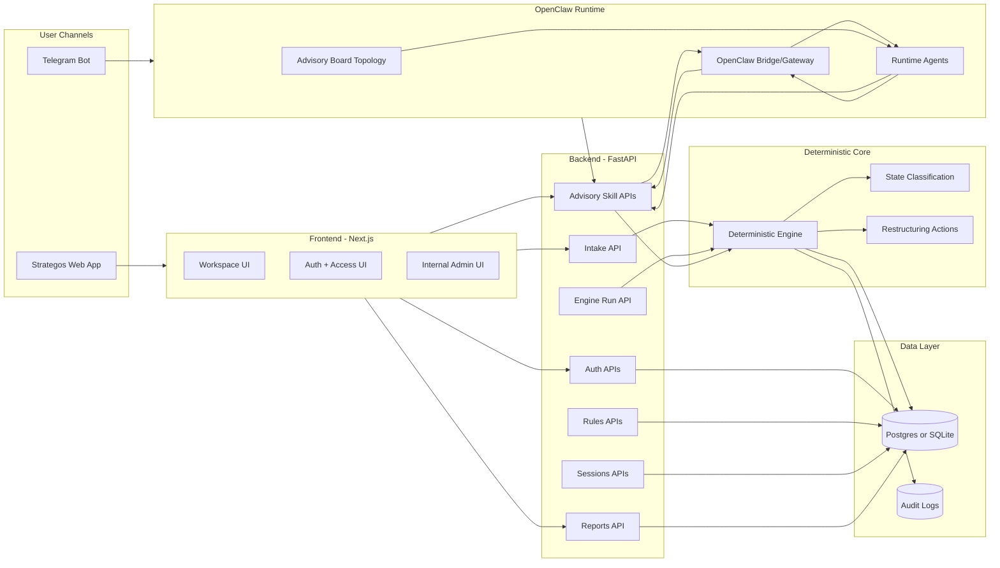

# STRATEGOS

STRATEGOS is an enterprise transformation platform with two execution channels:

1. Strategos web app (Next.js + FastAPI)
2. OpenClaw advisory agents (Telegram/OpenClaw runtime)

It combines a deterministic scoring engine with a cumulative multi-agent advisory chain.

## Current Status

- Deterministic engine: active
- Web workspace: active
- OpenClaw advisory chain: active (integrated mode)
- Strategos-only fallback mode: active (switchable)
- Auth (signup/login/verification/reset/admin approval): active
- PDF/CSV report export: active
- Payments (Stripe/Razorpay): not implemented yet (planned)

## Monorepo Layout

- Frontend: `frontend/` (Next.js App Router)
- Backend: `backend/` (FastAPI + SQLAlchemy + Alembic)
- OpenClaw integration bundle: `backend/openclaw/`
- Deploy and ops scripts: `backend/scripts/`
- Architecture docs: `docs/`

## System Architecture



## Runtime Flows

Both channels use the same advisory agent chain when execution mode is `integrated`.

### 1) Strategos web flow

1. User opens workspace and submits natural language context.
2. Frontend calls `POST /api/v1/intake`.
3. Backend extracts/normalizes metrics and runs deterministic engine.
4. Snapshot is stored in `transformation_sessions`.
5. Frontend calls `GET /api/v1/advisory/skills/board_insights/{session_id}`.
6. Backend invokes the OpenClaw advisory agents in cumulative chain order.
7. Frontend renders state, score, risk detail, roadmap, and agent insights.
8. User can export PDF/CSV via `/api/v1/reports/{session_id}`.

### 2) OpenClaw/Telegram flow

1. Telegram message is routed through OpenClaw.
2. OpenClaw calls Strategos advisory skill endpoints.
3. Strategos deterministic engine produces canonical evidence.
4. Advisory chain runs in fixed order (cumulative handoff):
   - `schema_extraction_agent`
   - `strategy_advisor`
   - `architecture_advisor`
   - `risk_officer`
   - `financial_impact_advisor`
   - `synthesis_advisor`
5. Final synthesis is returned to Telegram/web.

If mode is switched to `strategos-only`, both channels skip OpenClaw calls and use deterministic fallback narratives.

## Deterministic and Agentic Design

Strategos is built as deterministic-core + agentic-interpretation:

- Deterministic core computes state, score, triggers, and actions.
- Agents cannot overwrite deterministic facts.
- Agents consume fixed context + step handoff history and produce structured narrative.
- Integrated mode can call OpenClaw LLM agents.
- Fallback mode uses deterministic narrative only.

## Key API Surface

- Health: `GET /api/v1/health`
- Auth:
  - `POST /api/v1/auth/register`
  - `POST /api/v1/auth/login`
  - `POST /api/v1/auth/verify-email`
  - `POST /api/v1/auth/password/forgot`
  - `POST /api/v1/auth/password/reset`
  - `GET /api/v1/auth/me`
  - Admin approvals under `/api/v1/auth/admin/*`
- Intake and engine:
  - `POST /api/v1/intake`
  - `POST /api/v1/engine/run`
- Sessions:
  - `POST /api/v1/sessions`
  - `GET /api/v1/sessions`
  - `GET /api/v1/sessions/{id}/snapshots`
  - `GET /api/v1/sessions/{id}/replay`
- Advisory skills:
  - `POST /api/v1/advisory/skills/create_session`
  - `POST /api/v1/advisory/skills/run_engine`
  - `GET /api/v1/advisory/skills/state/{session_id}`
  - `GET /api/v1/advisory/skills/contributions/{session_id}`
  - `GET /api/v1/advisory/skills/restructuring/{session_id}`
  - `GET /api/v1/advisory/skills/board_insights/{session_id}`
- Reports:
  - `GET /api/v1/reports/{session_id}?format=pdf|csv`

## Data and Database

### Local development

- Default DB: `sqlite+aiosqlite:///./strategos_dev.db`

### Production

- Recommended DB: PostgreSQL (including Supabase)
- Async driver: `asyncpg`
- Pooler compatibility (Supabase 6543/PgBouncer):
  - SQLAlchemy `NullPool`
  - prepared/statement cache disabled

### Core tables

- Domain: `model_versions`, `metrics`, `coefficients`, `rules`, `rule_conditions`, `rule_impacts`, `state_definitions`, `state_thresholds`, `transformation_sessions`, `audit_logs`
- Auth: `app_users`, `auth_tokens`, `tenants`

Migrations are under `backend/alembic/versions/`.

## OpenClaw Integration Files

- Skills contract: `backend/openclaw/skills/strategos_skills.json`
- Advisory board topology: `backend/openclaw/agents/strategos_advisory_board.json`
- Runtime agents: `backend/openclaw/agents/strategos_advisory_agents.runtime.json`
- Workspace skill: `backend/openclaw/workspace_skills/strategos-core/SKILL.md`

## Execution Modes (EC2)

Strategos backend supports two modes:

1. `integrated` mode
   - Uses OpenClaw for agent execution
2. `strategos-only` mode
   - Deterministic narrative fallback only

Switching scripts:

- Windows wrapper: `backend/scripts/switch_strategos_mode.ps1`
- Remote script: `backend/scripts/strategos_mode_switch.sh`

Example:

```powershell
powershell -ExecutionPolicy Bypass -File backend/scripts/switch_strategos_mode.ps1 -Mode status -RemoteHost <STRATEGOS_EC2_IP> -KeyPath <PATH_TO_PEM>
```

## OpenClaw Dashboard Access (secure context)

For browser-safe dashboard access, use local SSH tunnel:

```powershell
cd backend
./scripts/openclaw_dashboard_tunnel.ps1 -KeyPath <PATH_TO_PEM> -RemoteHost <OPENCLAW_EC2_IP>
```

Then open:

- `http://localhost:18889/chat?session=main`
- `http://localhost:18889/__openclaw__/canvas/#/agents`

## Reports

- CSV export includes score breakdown, rule triggers, restructuring actions.
- PDF export is generated via ReportLab with Strategos-themed styling.
- Rule expressions are converted to plain English in exports.

## Auth and Access Control

- Signup with role request (`admin|analyst|viewer`)
- Email verification tokens
- Password reset flow
- Tenant-scoped pending approval queue
- Admin approve/reject endpoints and UI (`/dashboard/access`)

## Local Setup

### Backend

```powershell
cd backend
python -m venv .venv
. .venv\Scripts\Activate.ps1
pip install --upgrade pip
pip install -r requirements.txt
python -m alembic -c alembic.ini upgrade head
uvicorn app.main:app --host 0.0.0.0 --port 8000 --reload
```

### Frontend

```powershell
cd frontend
npm install
npm run dev
```

## Deployment Scripts

- Backend EC2 deploy: `backend/scripts/deploy_strategos_ec2.ps1`
- OpenClaw skills deploy: `backend/scripts/deploy_openclaw_strategos_skill.ps1`
- OpenClaw agents deploy: `backend/scripts/deploy_openclaw_strategos_agents.ps1`
- OpenClaw E2E smoke test: `backend/scripts/smoke_openclaw_sara_e2e.ps1`

## Testing

Backend tests live in `backend/tests/`.

Run:

```powershell
cd backend
pytest -q
```

## Payments Status

Payments are not yet implemented in code.

Planned v1:

- Stripe checkout session endpoint
- Stripe webhook handler for subscription lifecycle
- Tenant-level plan/entitlement model
- Billing page under dashboard
- Usage and quota gating for advisory/intake endpoints

## Documentation

- Architecture and interaction details: `docs/STRATEGOS_ARCHITECTURE_AND_INTERACTION.md`
- Mermaid source: `docs/architecture.mmd`
- PNG-safe Mermaid: `docs/architecture_pngsafe.mmd`

## Security Notes

- Do not commit secrets (`.env`, API keys, PEM files).
- Keep SSH keys outside the repo.
- Use HTTPS in production for user-facing Strategos/OpenClaw URLs.
