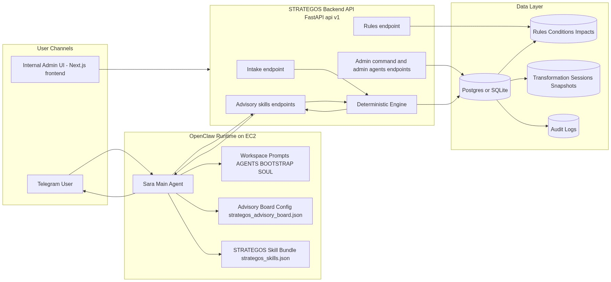
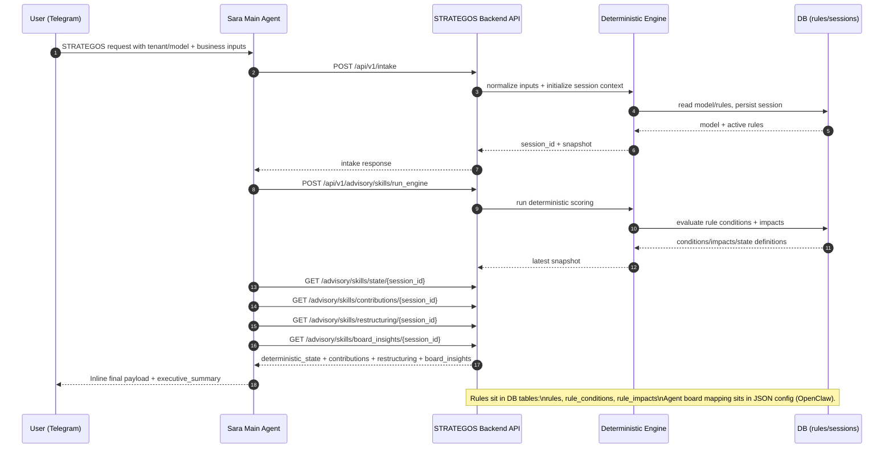

# STRATEGOS Architecture and Interaction Map

This document captures where components sit, where rules and agents are defined, and how runtime interactions happen.

PNG quick view (if Mermaid preview is unavailable):
- `docs/architecture-diagram.png`
- 

## 1) System Architecture

```mermaid
flowchart LR
  subgraph Client[User Channels]
    TG[Telegram User]
    WEB[Internal Admin UI\nNext.js frontend]
  end

  subgraph OC[OpenClaw Runtime on EC2]
    MAIN[Sara Main Agent]
    OCWS[Workspace Prompts\nAGENTS/BOOTSTRAP/SOUL]
    BOARD[Advisory Board Config\nstrategos_advisory_board.json]
    SKBUNDLE[STRATEGOS Skill Bundle\nstrategos_skills.json]
  end

  subgraph API[STRATEGOS Backend API\nFastAPI /api/v1]
    INTAKE[/intake]
    ADV[/advisory/skills/*]
    ADMIN[/admin/command + /admin/agents]
    RULES[/rules]
    ENGINE[Deterministic Engine]
  end

  subgraph DATA[Data Layer]
    DB[(Postgres/SQLite)]
    RSET[(Rules + Conditions + Impacts)]
    SESS[(Transformation Sessions + Snapshots)]
    AUD[(Audit Logs)]
  end

  TG --> MAIN
  WEB --> API
  MAIN --> OCWS
  MAIN --> BOARD
  MAIN --> SKBUNDLE
  MAIN --> ADV

  INTAKE --> ENGINE
  ADV --> ENGINE
  RULES --> RSET
  ADMIN --> DB
  ENGINE --> DB
  DB --> RSET
  DB --> SESS
  DB --> AUD

  ENGINE --> ADV
  ADV --> MAIN
  MAIN --> TG
```

## 2) Interaction Diagram (STRATEGOS Request)



## 3) Where Things Live

- Agents (advisory board roles and skill mapping): `backend/openclaw/agents/strategos_advisory_board.json`
- Runtime STRATEGOS agent registrations (OpenClaw runtime profile): `backend/openclaw/agents/strategos_advisory_agents.runtime.json`
- STRATEGOS skill endpoint mapping: `backend/openclaw/skills/strategos_skills.json`
- Backend API router composition: `backend/app/main.py`
- Deterministic data entities (rules, sessions, audit): `backend/app/db/models.py`
- Internal admin page (rules + agent CRUD UI): `frontend/app/internal/admin/page.tsx`

## 4) Key Clarifications

- Sara is the global router and can still handle non-STRATEGOS intents.
- STRATEGOS logic is intent-scoped: only STRATEGOS requests go through deterministic STRATEGOS flow.
- Rules are persisted in DB (not in the board JSON): `rules`, `rule_conditions`, `rule_impacts`.
- Advisory board agent identities and role responsibilities are in JSON config (OpenClaw side), while deterministic outcomes come from backend engine + DB.
